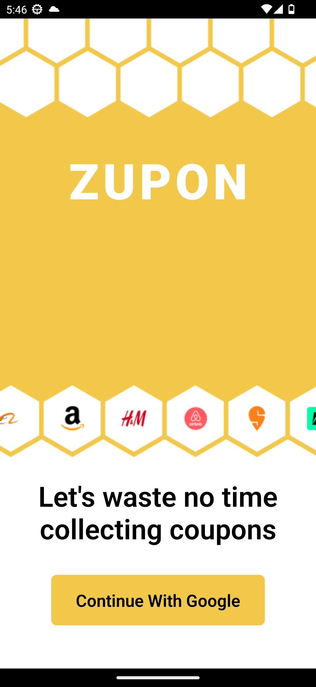
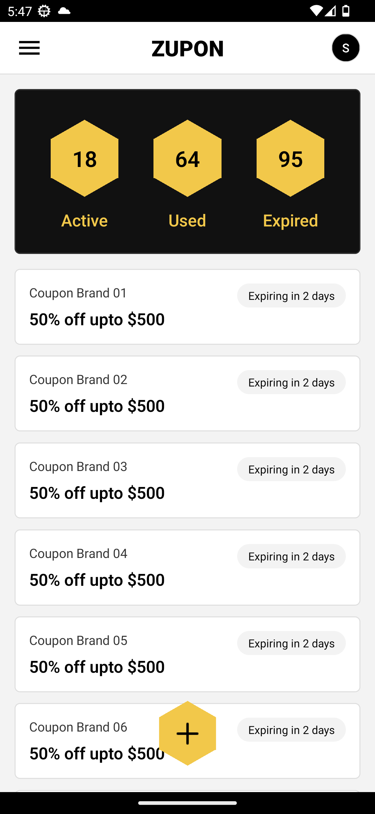
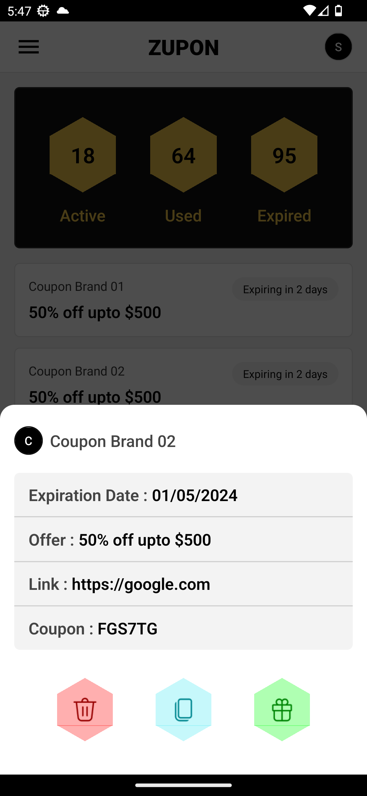
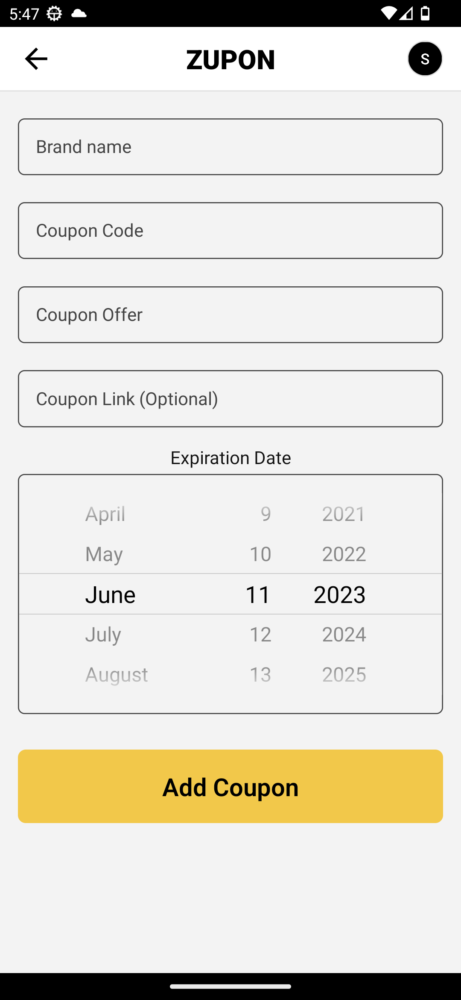

# Zupon

## Project Overview

Zupon is a React Native app that helps users save money by automatically storing coupons received in their SMS inbox, email, and shopping apps. The app simplifies the process of saving coupons, ensuring that users never miss out on potential savings.

## Features

-   Automatic Coupon Capture: Zupon automatically detects and saves coupons from SMS messages, emails, and supported shopping apps.
-   Centralized Coupon Storage: All saved coupons are stored within the app, providing users with a convenient way to access and manage their discounts.
-   Smart Sorting and Categorization: Coupons are intelligently categorized based on type, expiry date, and associated retailers.
-   Notification Alerts: Users receive notifications for expiring coupons and new offers from favorite retailers.
-   Seamless Integration: Zupon integrates with popular shopping apps and supports major SMS and email providers.

## Screenshots

| Landing Screen                                    | Home Screen                                    | View Coupon Screen                                    | Add Coupon Screen                                    |
| ------------------------------------------------- | ---------------------------------------------- | ----------------------------------------------------- | ---------------------------------------------------- |
|  |  |  |  |

## Installation

1. Clone the repository: `git clone https://github.com/satyamskillz/zupon.git`
2. Navigate to the project directory: `cd zupon`
3. Install the dependencies: `npm install`
4. Connect your mobile device or launch an emulator.
5. Start the development server: `npm start`
6. Follow the instructions to run the app on your device/emulator.

## Usage

1. Launch the Zupon app on your mobile device/emulator.
2. Grant the necessary permissions for SMS access, email access, and notifications.
3. Zupon will automatically scan your SMS inbox, email, and supported shopping apps for coupons.
4. View and manage your saved coupons within the app's user interface.
5. To use a coupon, present it to the cashier or follow the retailer's instructions.

## Contributing

Contributions to Zupon are welcome! If you'd like to contribute to the project, please follow these steps:

1. Fork the repository.
2. Create a new branch: `git checkout -b feature/your-feature-name`
3. Make your changes and commit them: `git commit -m 'Add some feature'`
4. Push your changes to the branch: `git push origin feature/your-feature-name`
5. Submit a pull request outlining your changes.

## Resources

1. Google Auth Setup Blog: [Link] (https://dev.to/suyashdev/google-authsignin-in-react-native-without-firebase-43n)

## License

The Zupon project is licensed under the [MIT License](LICENSE).

## Contact

For any inquiries or questions, please reach out to the project maintainers:

-   [Satyam Sharma](mailto:satyamskillz@example.com)
-   [Twitter - Satyamkillz](https://twitter.com/satyamskillz)

Feel free to visit the project repository at [https://github.com/satyamskillz/zupon](https://github.com/your-username/zupon) for more information and updates.
